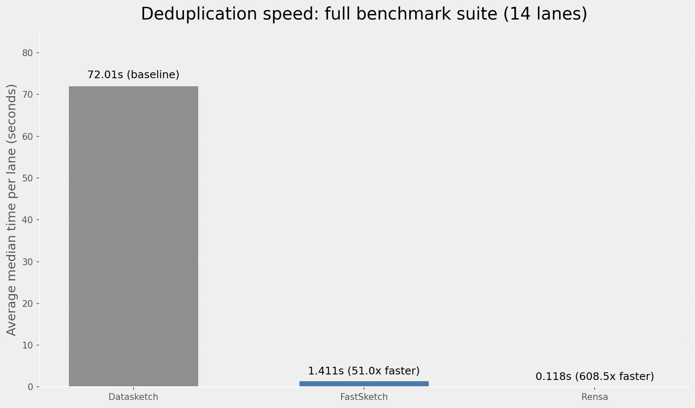

# Rensa

High-performance MinHash in Rust with Python bindings. On the latest full benchmark suite, Rensa is 608.52x faster than datasketch and 11.92x faster than FastSketch, with near-identical results.

## What is Rensa?

Rensa (Swedish for "clean") computes MinHash signatures for similarity estimation and deduplication. If you need to find near-duplicates in large datasets, Rensa does what datasketch does, much faster.

It ships two MinHash variants:

- **R-MinHash**: Rensa's own variant. Very close to datasketch output, fastest option.
- **C-MinHash**: Based on the [C-MinHash paper](https://arxiv.org/abs/2109.03337). Slightly different results, backed by formal variance proofs.

[](https://colab.research.google.com/drive/1o1nzwXWAa8kdkEJljbJFW1VuI-3VZLUn?usp=sharing) &nbsp; Thanks [mlabonne](https://github.com/mlabonne) for the Colab notebook!

## Performance

Numbers below come from the latest full benchmark run (`benchmarks/full_benchmark.py`) over 7 datasets and 2 thread lanes (`threads=1,8`), 128 permutations, threshold 0.8, and 8 bands.



| Comparison | Average speedup |
| ---------- | --------------- |
| **Rensa vs Datasketch** | **608.52x faster** |
| **Rensa vs FastSketch** | **11.92x faster** |

| Accuracy vs Datasketch | Value |
| ---------------------- | ----- |
| Mean Jaccard of kept sets | 0.987219 |
| Mean duplicate-flag mismatch rate | 0.010717 |

These accuracy metrics are from the same full benchmark run as the speed numbers above.

## How R-MinHash works

MinHash estimates Jaccard similarity between sets. Apply k random hash functions to a set, keep the minimum value from each. Two sets sharing many elements will produce similar minimums, and the fraction of matching slots estimates the Jaccard index.

Standard implementations generate each permutation as `(a * hash(x) + b) mod p`, where p is a large prime (typically the Mersenne prime 2^61 - 1). Mathematically clean, but modular reduction is still more expensive than a simple bit shift on modern CPUs.

R-MinHash replaces the modular reduction with **multiply-shift hashing**:

```
signature[i] = min { (a[i] * hash(x) + b[i]) >> 32 }  for all x in set
```

Instead of reducing mod a prime, take the upper 32 bits of the 64-bit multiply-add. This is a proven universal hash family ([Dietzfelbinger et al., 1997](https://doi.org/10.1006/jagm.1997.0873)). In R-MinHash, it is used as a practical approximation that keeps deduplication results very close to datasketch in benchmarks while making the hot path cheaper.

This choice has a useful side effect: since the output is naturally 32 bits, signatures are stored as `u32` — 4 bytes per slot instead of 8. For 128 permutations, that's 512 bytes per signature. Half the memory, and twice as many signature slots fit in a cache line.

### Performance engineering

On top of the algorithm, Rensa applies several low-level optimizations.

Input elements are hashed with a fast non-cryptographic hash that mirrors `rustc_hash::FxHasher` semantics while avoiding trait dispatch in the hot path. MinHash needs uniform distribution, not collision resistance, so there's no reason to pay for a cryptographic hash function.

Elements are hashed in groups of 32. Permutations are applied to each batch in chunks of 16, using a fixed-size temporary array (`[u32; 16]`) that is register-friendly. This gives the compiler room to optimize tight loops and keeps working data cache-local.

The (a, b) permutation pairs are deterministic, derived from a seed via Xoshiro256++. They are initialized at construction and reused across updates to avoid recomputing setup state on every incremental update.

The global allocator is MiMalloc, which handles the batch-allocate-then-free pattern better than the system default.

### C-MinHash

Rensa also includes C-MinHash, based on the [C-MinHash paper](https://arxiv.org/abs/2109.03337). It uses a two-stage scheme (sigma then pi) that reduces the need for k independent permutations by deriving the k slots from a small parameter set. In this implementation, that means `sigma_a/sigma_b` and `pi_c/pi_d`, with precomputed pi terms for speed. The paper proves tighter variance bounds than standard MinHash. In practice, both variants produce similar results and R-MinHash is usually a bit faster. Use R-MinHash unless you have a specific reason not to.

## Installation

```bash
pip install rensa
```

Works on Linux, macOS, and Windows. Python >= 3.8.

## Usage

### Computing similarity

```python
from rensa import RMinHash

m1 = RMinHash(num_perm=128, seed=42)
m1.update("the quick brown fox jumps over the lazy dog".split())

m2 = RMinHash(num_perm=128, seed=42)
m2.update("the quick brown fox jumps over the lazy cat".split())

print(m1.jaccard(m2))  # ~0.78
```

`CMinHash` has the same interface. Just swap the class name.

### Deduplicating a dataset

```python
from datasets import load_dataset
from rensa import RMinHash, RMinHashLSH

dataset = load_dataset("gretelai/synthetic_text_to_sql")["train"]

# Build MinHash signatures
minhashes = {}
for idx, row in enumerate(dataset):
    m = RMinHash(num_perm=128, seed=42)
    m.update(row["sql"].split())
    minhashes[idx] = m

# Index into LSH
lsh = RMinHashLSH(threshold=0.8, num_perm=128, num_bands=16)
for doc_id, mh in minhashes.items():
    lsh.insert(doc_id, mh)

# Find and remove duplicates
to_remove = set()
for doc_id, mh in minhashes.items():
    if doc_id in to_remove:
        continue
    for candidate in lsh.query(mh):
        if candidate != doc_id and candidate not in to_remove:
            if mh.jaccard(minhashes[candidate]) >= 0.85:
                to_remove.add(max(doc_id, candidate))

print(f"Removed {len(to_remove)} duplicates from {len(dataset)} rows")
```

### Batch APIs

For large batches, build and query in bulk to reduce Python call overhead:

```python
from rensa import RMinHash, RMinHashLSH, RMinHashDeduplicator

token_sets = [
    "select id from users".split(),
    "select name from users".split(),
    "select id from users".split(),
]
keys = [f"doc-{idx}" for idx in range(len(token_sets))]

minhashes = RMinHash.from_token_sets(token_sets, num_perm=128, seed=42)
digests = RMinHash.digests_from_token_sets(token_sets, num_perm=128, seed=42)

lsh = RMinHashLSH(threshold=0.8, num_perm=128, num_bands=8)
lsh.insert_pairs(enumerate(minhashes))
candidates_per_doc = lsh.query_all(minhashes)

dedup = RMinHashDeduplicator(threshold=0.8, num_perm=128, use_lsh=True, num_bands=8)
added_flags = dedup.add_pairs(zip(keys, minhashes))
is_dup_flags = dedup.is_duplicate_pairs(zip(keys, minhashes))
duplicate_sets = dedup.get_duplicate_sets(minhashes)
```

`CMinHash` supports the same batch constructors, plus `digests64_from_token_sets(...)`.

For expert throughput paths (when you already have hashed tokens or byte tokens):

```python
from rensa import CMinHash, RMinHash

token_sets = [
    "select id from users".split(),
    "select name from users".split(),
]
token_hash_sets = RMinHash.hash_token_sets(token_sets)

r_matrix = RMinHash.digest_matrix_from_token_hash_sets(
    token_hash_sets, num_perm=128, seed=42
)
byte_matrix = RMinHash.digest_matrix_from_token_byte_sets(
    [[b"alpha", b"beta"], [b"gamma", b"delta"]],
    num_perm=128,
    seed=42,
)
c_digests64 = CMinHash.digests64_from_token_hash_sets(
    token_hash_sets, num_perm=128, seed=42
)
```

### Streaming deduplication

For continuous data streams, use the built-in deduplicator:

```python
from rensa import RMinHash, RMinHashDeduplicator

dedup = RMinHashDeduplicator(threshold=0.8, num_perm=128, use_lsh=True, num_bands=16)

for doc in document_stream:
    mh = RMinHash(num_perm=128, seed=42)
    mh.update(doc["text"].split())

    if not dedup.is_duplicate(doc["id"], mh):
        dedup.add(doc["id"], mh)
        # process unique document
```

## API

### RMinHash / CMinHash

| Method                           | Description                                                |
| -------------------------------- | ---------------------------------------------------------- |
| `__init__(num_perm, seed)`       | Create a MinHash with `num_perm` permutations              |
| `update(items)`                  | Add items (list of strings, bytes, or iterables)           |
| `jaccard(other)`                 | Estimate Jaccard similarity (requires matching `num_perm`) |
| `digest()`                       | Return the signature as a list of integers                 |
| `from_token_sets(...)`           | Build many MinHash objects from token iterables            |
| `digests_from_token_sets(...)`   | Compute many digests in one call                           |
| `hash_token_sets(...)`           | Hash token sets to reusable `u64` token hashes             |
| `digest_matrix_from_token_sets(...)` | Build compact row-major digest matrix                  |
| `digest_matrix_from_token_hash_sets(...)` | Build compact digest matrix from pre-hashed `u64` tokens |
| `digest_matrix_from_token_byte_sets(...)` | Build compact digest matrix from bytes-like tokens |
| `digests64_from_token_sets(...)` | `CMinHash` only, returns `u64`-precision digests           |
| `digests64_from_token_hash_sets(...)` | `CMinHash` only, uses pre-hashed `u64` tokens         |

### RMinHashLSH

| Method                                     | Description                                                    |
| ------------------------------------------ | -------------------------------------------------------------- |
| `__init__(threshold, num_perm, num_bands)` | Create an LSH index. `num_bands` must divide `num_perm` evenly |
| `insert(key, minhash)`                     | Add a document to the index                                    |
| `query(minhash)`                           | Return candidate similar document keys                         |
| `remove(key)`                              | Remove a document from the index                               |
| `insert_pairs(entries)`                    | Insert many `(key, minhash)` pairs                             |
| `insert_many(minhashes, start_key=0)`      | Insert many `minhashes` with sequential keys                   |
| `query_all(minhashes)`                     | Query many minhashes in one call                               |
| `query_duplicate_flags(minhashes)`         | Return `len(query(minhash)) > 1` flags for many minhashes      |

### RMinHashDeduplicator / CMinHashDeduplicator

| Method                                                               | Description                                 |
| -------------------------------------------------------------------- | ------------------------------------------- |
| `RMinHashDeduplicator(threshold, num_perm, use_lsh, num_bands=None, seed=42)` | R-MinHash streaming deduplicator            |
| `CMinHashDeduplicator(threshold, num_perm=None, seed=42)`           | C-MinHash streaming deduplicator            |
| `add(key, minhash) -> bool`                                          | Add if unique, returns whether it was added |
| `is_duplicate(key, minhash) -> bool`                                 | Check without adding                        |
| `get_duplicates(minhash) -> list[str]`                               | Find keys of similar stored items           |
| `remove(key)` / `clear()`                                            | Manage stored items                         |
| `add_pairs(entries) -> list[bool]`                                   | Batch add `(key, minhash)` or `(key, token_set)` pairs |
| `is_duplicate_pairs(entries) -> list[bool]`                          | Batch duplicate checks for minhash or token-set pairs  |
| `get_duplicate_sets(minhashes) -> list[list[str]]`                   | Batch duplicate candidate lookup (minhash or token-set inputs) |

## Running Benchmarks

```bash
git clone https://github.com/beowolx/rensa.git && cd rensa
uv venv && uv sync --group bench --no-install-project
uv run maturin develop --release
uv run python benchmarks/simple_benchmark.py
```

Run the full cross-library benchmark (single-thread + multi-thread lanes):

```bash
uv run python benchmarks/full_benchmark.py
```

`benchmarks/` now contains two scripts:

- `benchmarks/simple_benchmark.py`: single-thread quick comparison across Datasketch, FastSketch, R-MinHash, and C-MinHash.
- `benchmarks/full_benchmark.py`: fair process-isolated benchmark across Datasketch, FastSketch, and Rensa on the full dataset preset suite.

## Contributing

Contributions welcome, just open a PR or issue.

## License

MIT
