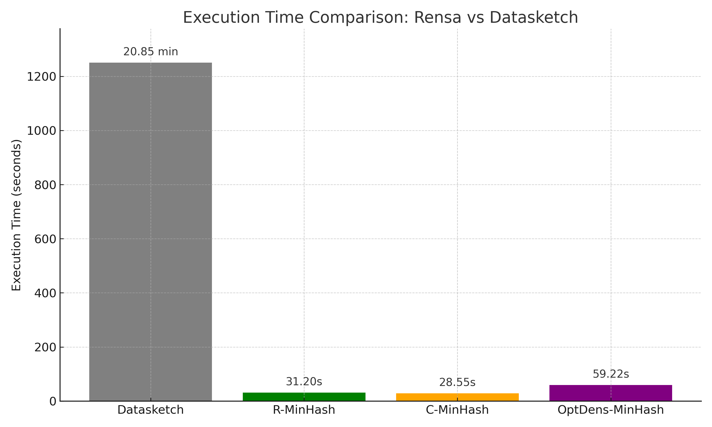
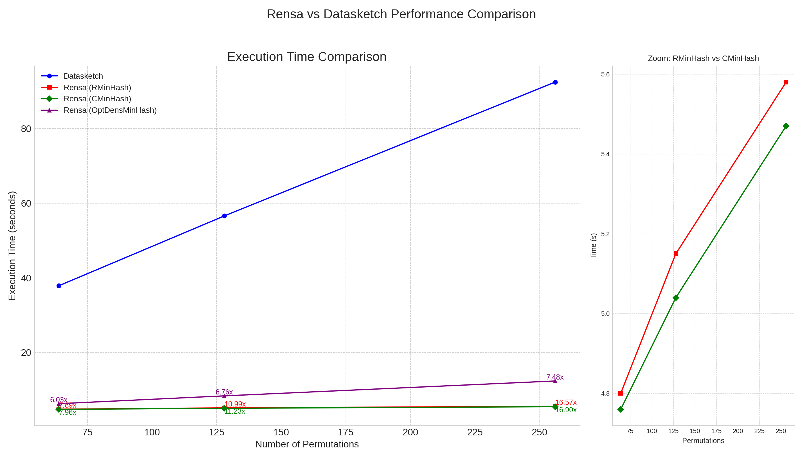

# Rensa: A novel high-performance MinHash Implementation in Rust

## Introduction

Rensa (Swedish for "clean") is a high-performance MinHash suite written in Rust with Python bindings. It's designed for efficient similarity estimation and deduplication of large datasets. **It's 40x faster than `datasketch` for MinHash operations while producing the same results and consuming less memory.**



Rensa initially implemented a variant of the MinHash algorithm (`R-MinHash`) that combined ideas from traditional MinHash and the C-MinHash algorithm. It now also offers a more direct `C-MinHash` implementation.

Rensa is particularly useful in scenarios where you need to:

- Quickly estimate the similarity between large sets of data
- Deduplicate large datasets
- Perform locality-sensitive hashing (LSH) for approximate nearest neighbor search

Use cases include:
- Content deduplication in large document collections
- Identifying similar items in recommendation systems
- Clustering of high-dimensional data
- Near-duplicate detection in web crawling

## Quick Start with Google Colab

Want to try Rensa right away? Check out our interactive Google Colab notebook that demonstrates how to use Rensa to deduplicate a dataset from Hugging Face:

[](https://colab.research.google.com/drive/1o1nzwXWAa8kdkEJljbJFW1VuI-3VZLUn?usp=sharing)

Thanks [mlabonne](https://github.com/mlabonne) for the Colab notebook!

## Table of Contents

- [Rensa: A novel high-performance MinHash Implementation in Rust](#rensa-a-novel-high-performance-minhash-implementation-in-rust)
  - [Introduction](#introduction)
  - [Technical Implementation](#technical-implementation)
    - [R-MinHash (Original Rensa Variant)](#r-minhash-original-rensa-variant)
    - [C-MinHash (Based on the C-MinHash Paper)](#c-minhash-based-on-the-c-minhash-paper)
  - [Installation](#installation)
  - [Usage Example](#usage-example)
    - [Deduplicating with Direct MinHash](#deduplicating-with-direct-minhash)
    - [Using C-MinHash for Similarity](#using-c-minhash-for-similarity)
    - [Deduplicating with RMinHashLSH](#deduplicating-with-rminhashlsh)
    - [Inline Deduplication for Streaming Data](#inline-deduplication-for-streaming-data)
  - [Algorithm Comparison: R-MinHash vs. C-MinHash vs. Datasketch](#algorithm-comparison-r-minhash-vs-c-minhash-vs-datasketch)
  - [Benchmark Results](#benchmark-results)
    - [MinHash Implementations Speed](#minhash-implementations-speed)
    - [MinHash Implementations Accuracy (Deduplication Results)](#minhash-implementations-accuracy-deduplication-results)
    - [LSH Performance (RMinHashLSH vs. Datasketch MinHashLSH)](#lsh-performance-rminhashlsh-vs-datasketch-minhashlsh)
  - [Running the Benchmarks](#running-the-benchmarks)
  - [Limitations and Future Work](#limitations-and-future-work)
  - [Contributing](#contributing)
  - [License](#license)


## Technical Implementation

Rensa offers two high-performance MinHash variants in Rust: `R-MinHash` (its original novel approach) and `C-MinHash` (an implementation closely following the C-MinHash paper). Both are designed for efficient similarity estimation and leverage common strategies for speed and memory efficiency:
- **Fast Hash Functions**: Rensa employs fast, non-cryptographic hash functions (based on FxHash or Murmur3) for processing input items.
- **Memory-Efficient Data Structures**: Implementations use compact data structures to minimize memory usage while maintaining fast access times.
- **Optimized Routines**: Core operations are optimized using techniques like batch processing and vectorized operations where appropriate.

### R-MinHash (Original Rensa Variant)

This variant was Rensa's initial novel approach. Key aspects of Rensa's `RMinHash` implementation include:

1.  **Efficient Permutation Generation**: Instead of storing full permutations or using k independent hash functions, Rensa's `RMinHash` uses a unique pair of random numbers (a, b) for each of the `num_perm` permutations. These are used to generate hash values on-the-fly for each item.

2.  **Simplified Approach**: While inspired by ideas related to C-MinHash, `RMinHash` is a distinct, simpler approach.
    - It does not apply an initial global permutation (σ) to the input data's hash in the same way as described in the C-MinHash paper for its primary permutation step.
    - It uses `num_perm` distinct pairs of random numbers (a, b) to simulate `num_perm` independent hash functions, rather than deriving them from a smaller set of parameters in a circulant manner.

3.  **Trade-off**: `RMinHash`'s approach trades some of the potential variance reduction benefits of more complex MinHash schemes (like full C-MinHash) for simplicity and good performance. It still offers better performance than traditional MinHash in many scenarios.

Rensa's Locality-Sensitive Hashing (LSH) implementation, `RMinHashLSH`, currently utilizes the `RMinHash` variant for its index.

### C-MinHash (Based on the C-MinHash Paper)

Rensa also includes `CMinHash`, an implementation more directly aligned with the principles of the C-MinHash algorithm from the paper "[C-MinHash: Rigorously Reducing K Permutations to Two](https://arxiv.org/abs/2109.03337)". Key aspects of this implementation are:

1.  **Two-Stage Hashing**: It utilizes two sets of universal hash function parameters for its permutation scheme:
    - An initial hash transformation (σ) is applied to the hash of each input item using parameters `sigma_a` and `sigma_b`.
    - A second pair of parameters, `pi_c` and `pi_d`, are used in combination with the σ-transformed item hash to generate the `num_perm` values in the MinHash signature. Specifically, for the `k`-th hash slot (where `k` is from 0 to `num_perm-1`), the value is derived from `(pi_c * sigma_transformed_hash + (pi_c * k + pi_d))`. The `(pi_c * k + pi_d)` terms are precomputed for each `k` to enhance efficiency.
2.  **Highly Optimized Routines**: The `update` and `jaccard` methods in `CMinHash` are heavily optimized. This includes batch processing of input items, structuring calculations to improve cache utilization, and using vectorized operations (e.g., processing data in fixed-size chunks like blocks of 16 or 8) for faster computations.
3.  **Performance Focus**: This implementation is specifically engineered for maximum single-threaded performance through these aggressive optimizations and careful memory access patterns.


These design choices result in a suite of MinHash implementations that are fast, memory-efficient, and suitable for large-scale similarity estimation and deduplication tasks. Benchmarks show that Rensa's implementations offer significant performance improvements over traditional MinHash libraries like `datasketch`.

## Installation

You can install Rensa using `pip`. It's available in all platforms:

```bash
pip install rensa
```

## Input Validation and Errors

Rensa validates constructor and API invariants up front and raises `ValueError` for invalid inputs (instead of aborting the Python process).

Key constraints:
- `RMinHash(num_perm=...)` and `CMinHash(num_perm=...)`: `num_perm` must be greater than `0`.
- `RMinHashLSH(threshold, num_perm, num_bands)`:
  - `threshold` must be finite and in `[0.0, 1.0]`.
  - `num_perm` must be greater than `0`.
  - `num_bands` must be greater than `0`.
  - `num_bands <= num_perm`.
  - `num_perm % num_bands == 0`.
- `jaccard` comparisons require matching `num_perm` on both signatures.

## Usage Example

### Deduplicating with Direct MinHash

Here's an example of how to use Rensa's MinHash implementations (e.g., `RMinHash`, `CMinHash`) for direct deduplication:

```python
from datasets import load_dataset
from rensa import RMinHash, CMinHash
from tqdm import tqdm

# Define a function to generate MinHash (works for RMinHash, CMinHash)
def generate_minhash_signature(text, minhash_class, num_perm=128, seed=42):
    m = minhash_class(num_perm=num_perm, seed=seed)
    m.update(text.split())
    return m

def deduplicate_dataset_direct(dataset, text_column="sql", minhash_class=RMinHash, num_perm=128, desc="Deduplicating"):
    unique_hashes = set()
    deduplicated_indices = []
   
    for idx, example in tqdm(enumerate(dataset), total=len(dataset), desc=desc):
        minhash_obj = generate_minhash_signature(example[text_column], minhash_class, num_perm)
        hash_tuple = tuple(minhash_obj.digest())
       
        if hash_tuple not in unique_hashes:
            unique_hashes.add(hash_tuple)
            deduplicated_indices.append(idx)
           
    return deduplicated_indices

def main_direct_deduplication():
    print("Loading dataset...")
    sql_dataset_dict = load_dataset("gretelai/synthetic_text_to_sql")
    sql_dataset = sql_dataset_dict["train"]
   
    print("Deduplicating dataset with R-MinHash...")
    deduplicated_indices_r = deduplicate_dataset_direct(
        sql_dataset,
        text_column="sql",
        minhash_class=RMinHash,
        desc="R-MinHash Deduplication"
    )
    deduplicated_dataset_r = sql_dataset.select(deduplicated_indices_r)
   
    print(f"Original dataset size: {len(sql_dataset)}")
    print(f"Deduplicated dataset size (R-MinHash): {len(deduplicated_dataset_r)}")
    print(f"Rows removed (R-MinHash): {len(sql_dataset) - len(deduplicated_dataset_r)}")

    # Example with C-MinHash
    # print("Deduplicating dataset with C-MinHash...")
    # deduplicated_indices_c = deduplicate_dataset_direct(
    #     sql_dataset,
    #     text_column="sql",
    #     minhash_class=CMinHash,
    #     desc="C-MinHash Deduplication"
    # )
    # deduplicated_dataset_c = sql_dataset.select(deduplicated_indices_c)
    # print(f"Deduplicated dataset size (C-MinHash): {len(deduplicated_dataset_c)}")

if __name__ == "__main__":
    main_direct_deduplication()
```

### Using C-MinHash for Similarity

Here's a more direct example of using `CMinHash` for calculating Jaccard similarity:

```python
from rensa import CMinHash

# Example texts
text1 = "This is an example sentence for CMinHash."
text2 = "This is another example sentence, slightly different from the first."

# Initialize CMinHash objects
num_permutations = 256
seed = 12345
c_minhash1 = CMinHash(num_perm=num_permutations, seed=seed)
c_minhash2 = CMinHash(num_perm=num_permutations, seed=seed)

# Update with words from each text
c_minhash1.update(text1.split())
c_minhash2.update(text2.split())

# Calculate Jaccard similarity
similarity = c_minhash1.jaccard(c_minhash2)
print(f"Estimated Jaccard similarity (CMinHash, {num_permutations} perm): {similarity:.4f}")

# Get signatures
signature1 = c_minhash1.digest()
# print(f"C-MinHash signature 1: {signature1}")
```

### Deduplicating with RMinHashLSH
Here's an example of how to use `RMinHashLSH` for deduplicating a dataset. This approach is more efficient for larger datasets. Key LSH parameters are set to example values within the function.

```python
from datasets import load_dataset
from rensa import RMinHash, RMinHashLSH
from tqdm import tqdm

def deduplicate_dataset_with_lsh_simple(dataset, text_column="sql"):
    num_perm = 128
    seed = 42
    lsh_threshold = 0.8
    num_bands = 16 
    final_jaccard_threshold = 0.85

    if num_perm % num_bands != 0:
        raise ValueError(f"num_bands ({num_bands}) must divide num_perm ({num_perm}).")

    minhashes = {} 
   
    for idx, example in tqdm(enumerate(dataset), total=len(dataset), desc="1. Generating RMinHashes"):
        text_content = str(example[text_column])
        tokens = text_content.split()
        m = RMinHash(num_perm=num_perm, seed=seed)
        m.update(tokens)
        minhashes[idx] = m

    lsh_index = RMinHashLSH(threshold=lsh_threshold, num_perm=num_perm, num_bands=num_bands)
    for doc_id, rminhash_obj in tqdm(minhashes.items(), desc="2. Indexing into LSH"):
        lsh_index.insert(doc_id, rminhash_obj)

    to_remove = set()
    sorted_doc_ids = sorted(minhashes.keys())

    for doc_id in tqdm(sorted_doc_ids, desc="3. Querying LSH & Deduplicating"):
        if doc_id in to_remove:
            continue

        query_minhash = minhashes[doc_id]
        candidate_ids = lsh_index.query(query_minhash)

        for candidate_id in candidate_ids:
            if candidate_id == doc_id or candidate_id in to_remove:
                continue
            
            candidate_minhash = minhashes[candidate_id]
            actual_jaccard = query_minhash.jaccard(candidate_minhash)

            if actual_jaccard >= final_jaccard_threshold:
                # Keep the item with the smaller original index
                if doc_id < candidate_id:
                    to_remove.add(candidate_id)
                else:
                    to_remove.add(doc_id)
                    break 
   
    deduplicated_indices = [idx for idx in sorted_doc_ids if idx not in to_remove]
    return deduplicated_indices

def main_lsh_deduplication_simple():
    print("Loading dataset...")
    try:
        sql_dataset_dict = load_dataset("gretelai/synthetic_text_to_sql")
        sql_dataset = sql_dataset_dict["train"]
    except Exception as e:
        print(f"Failed to load dataset: {e}. Ensure 'datasets' is installed or use a local dataset.")
        return

    print("Deduplicating dataset with RMinHashLSH...")
   
    deduplicated_indices_lsh = deduplicate_dataset_with_lsh_simple(
        sql_dataset,
        text_column="sql"
    )
    deduplicated_dataset_lsh = sql_dataset.select(deduplicated_indices_lsh)

    print(f"Original dataset size (train split): {len(sql_dataset)}")
    print(f"Deduplicated dataset size (RMinHashLSH): {len(deduplicated_dataset_lsh)}")
    print(f"Rows removed (RMinHashLSH): {len(sql_dataset) - len(deduplicated_dataset_lsh)}")

if __name__ == "__main__":
    main_lsh_deduplication_simple()
```

### Inline Deduplication for Streaming Data

Rensa now supports inline deduplication, perfect for scenarios where you receive continuous streams of data and need to check each new record against existing ones in real-time.

```python
from rensa import RMinHash, RMinHashDeduplicator


def inline_deduplication_example():
    # Initialize the deduplicator with similarity threshold
    # Adjust LSH parameters for the threshold
    deduplicator = RMinHashDeduplicator(
        threshold=0.7,  # Jaccard similarity threshold
        num_perm=128,  # Number of permutations
        use_lsh=True,  # Use LSH for efficiency
        num_bands=32,  # More bands = more sensitive to lower similarities
    )

    # Simulate streaming data with varying similarities
    document_stream = [
        {"id": "001", "text": "The quick brown fox jumps over the lazy dog"},
        {
            "id": "002",
            "text": "The quick brown fox jumps over the lazy dog today",
        },  # Very similar
        {
            "id": "003",
            "text": "A fast brown fox leaps over a sleepy dog",
        },  # Somewhat similar
        {"id": "004", "text": "Lorem ipsum dolor sit amet consectetur"},
        {
            "id": "005",
            "text": "The quick brown fox jumps over the lazy dog",
        },  # Exact duplicate
        {
            "id": "006",
            "text": "Quick brown foxes jump over lazy dogs",
        },  # Similar paraphrase
        {"id": "007", "text": "Completely different content here"},
    ]

    # Process each document as it arrives
    for doc in document_stream:
        # Create MinHash for the new document
        minhash = RMinHash(num_perm=128, seed=42)
        minhash.update(doc["text"].split())

        # Check if it's a duplicate
        if deduplicator.is_duplicate(doc["id"], minhash):
            # Find which documents it duplicates
            duplicates = deduplicator.get_duplicates(minhash)
            print(f"Document {doc['id']} is a duplicate of: {duplicates}")
        else:
            # Add to the deduplicator if unique
            if deduplicator.add(doc["id"], minhash):
                print(f"Document {doc['id']} added (unique)")

    print(f"\nTotal unique documents: {deduplicator.len()}")


if __name__ == "__main__":
    inline_deduplication_example()
```

#### Inline Deduplication API

All deduplicators (`RMinHashDeduplicator`, `CMinHashDeduplicator`) support the following methods:

- `add(key: str, minhash) -> bool`: Add a new item if it's not a duplicate. Returns True if added.
- `is_duplicate(key: str, minhash) -> bool`: Check if an item is a duplicate without adding it.
- `get_duplicates(minhash) -> List[str]`: Get list of keys that are duplicates of the given MinHash.
- `remove(key: str) -> bool`: Remove an item from the deduplicator.
- `len() -> int`: Get the number of unique items stored.
- `clear()`: Remove all items from the deduplicator.

**Performance Tips for Inline Deduplication:**

1. **Use LSH for large datasets**: When dealing with thousands of documents, enable LSH (`use_lsh=True`) for `RMinHashDeduplicator`.
2. **Adjust threshold**: Lower thresholds catch more duplicates but may have false positives.
3. **Batch when possible**: If you receive data in small batches, process them together for better performance.
4. **Memory management**: For very large datasets, consider implementing a sliding window or periodic cleanup of old entries.

## Algorithm Comparison: R-MinHash vs. C-MinHash vs. Datasketch

Rensa offers two MinHash implementations (`RMinHash`, `CMinHash`), each with different trade-offs compared to each other and the popular `datasketch` library.

Based on the latest `advanced_benchmark.py` results (averaged over 5 runs on the `gretelai/synthetic_text_to_sql` dataset, 100,000 rows, in a Macbook Pro M2 32GB):

  * **Speed (at 256 permutations)**:

      * **`CMinHash`** is consistently the fastest. Average execution time: **5.47 seconds**.
      * **`RMinHash`** is also very fast. Average execution time: **5.58 seconds**.
      * **`datasketch`** is considerably slower. Average execution time: **92.45 seconds**.
        This makes `CMinHash` up to approximately **16.90x faster** than `datasketch` and `RMinHash` up to approximately **16.57x faster** (all at 256 permutations).

  * **Accuracy (Jaccard Similarity of Deduplicated Sets vs. Datasketch, 128 permutations)**:

      * **`RMinHash`** produces deduplication results identical to `datasketch` (Jaccard similarity of **1.0000** between their output sets of unique items, with 99262 common items).
      * **`CMinHash`** also yields results very close to `datasketch`. The Jaccard similarity is **0.9996** (with 99223 common items with Datasketch).
        This indicates that while both Rensa variants are highly effective for similarity estimation, `RMinHash` perfectly matches `datasketch`'s deduplication output in this benchmark and `CMinHash` produces extremely similar results.

  * **Recommendation**:

      * For most use cases, **`RMinHash`** provides an excellent balance of high speed (up to ~16.6x faster than `datasketch`) and accuracy (matching `datasketch`'s deduplication results). **It remains the generally recommended algorithm.**
      * If absolute maximum throughput is the primary concern, **`CMinHash`** offers the best performance (up to ~16.9x faster than `datasketch`), with a negligible difference in exact deduplication results compared to `datasketch`/`RMinHash`.
      * If you require features beyond core MinHash generation or need to integrate with an existing `datasketch` ecosystem, `datasketch` remains a comprehensive option, albeit slower for MinHash operations.

## Benchmark Results

Rensa offers significant performance advantages over traditional MinHash libraries like `datasketch`. Recent benchmarks demonstrate that Rensa's MinHash implementations are particularly powerful on large-scale, high-cardinality datasets.

### Large-Scale Benchmark (`Salesforce/wikitext`, 1.8 Million Rows)

The following benchmark was conducted using the large-scale `Salesforce/wikitext` dataset containing 1.8 million rows. This benchmark highlights Rensa's remarkable performance advantage:

* **R-MinHash** completed deduplication **\~39x faster** than `datasketch`.
* **C-MinHash** performance was similarly impressive.

**Performance comparison:**

| Algorithm       | Execution Time (s) | Speedup vs Datasketch |
| --------------- | ------------------ | --------------------- |
| Datasketch      | 1725               | -                     |
| Rensa R-MinHash | 44                 | **\~39x faster**      |
| Rensa C-MinHash | 42                 | **\~41x faster**      |

This benchmark clearly demonstrates Rensa's capability to handle large, diverse datasets at exceptional speed.

### Why Does Speedup Vary?

Benchmark speedups depend on dataset characteristics, including:

* **Cardinality (number of distinct elements)**
* **Document length and repetition rate**

High cardinality and large-scale datasets (such as `Salesforce/wikitext`) leverage Rensa's optimizations fully, achieving maximal performance gains.

### Previous Benchmarks (`gretelai/synthetic_text_to_sql`, 100K Rows)



Earlier benchmarks, using the smaller and more repetitive `gretelai/synthetic_text_to_sql` dataset, indicated approximately a **15x speedup** over `datasketch`. While still impressive, these speedups reflect differences in dataset characteristics:

| Algorithm            | Execution Time (s) | Speedup vs Datasketch |
| -------------------- | ------------------ | --------------------- |
| Datasketch           | 92.45              | -                     |
| Rensa R-MinHash      | 5.58               | **\~16.6x faster**    |
| Rensa C-MinHash      | 5.47               | **\~16.9x faster**    |

This demonstrates that Rensa significantly outperforms `datasketch` in all scenarios, with even greater gains on larger, high-cardinality datasets.

### Recommendation

* **Use `RMinHash` or `CMinHash`** for general purposes, especially with large-scale datasets, to achieve maximum performance.

Rensa consistently delivers high-performance MinHash implementations that outperform `datasketch` substantially, making it ideal for real-world, large-scale deduplication and similarity estimation tasks.


## Running the Benchmarks

To run the benchmarks yourself, follow these steps:

1. **Clone the repository:**

```bash
git clone https://github.com/beowolx/rensa.git
cd rensa
```

2. **Create a virtual environment:**

```bash
python3 -m venv venv
source venv/bin/activate
```

3. **Install the required dependencies:**

```bash
pip install -r requirements.txt
```

4. **Run the simple benchmark** (core MinHash deduplication on `gretelai/synthetic_text_to_sql`):

```bash
python benchmarks/simple_benchmark.py
```

You can also configure the benchmark run and emit CI-compatible JSON output:

```bash
python benchmarks/simple_benchmark.py \
  --dataset gretelai/synthetic_text_to_sql \
  --split train \
  --revision 740ab236e64503fba51be1101df7a1be83bf455d \
  --num-perm 128 \
  --warmup-runs 1 \
  --measured-runs 5 \
  --disable-progress \
  --output-json benchmark.json
```

Supported `simple_benchmark.py` flags:

- `--dataset` (default: `gretelai/synthetic_text_to_sql`)
- `--split` (default: `train`)
- `--revision` (default: `740ab236e64503fba51be1101df7a1be83bf455d`)
- `--num-perm` (default: `128`)
- `--warmup-runs` (default: `0`)
- `--measured-runs` (default: `1`)
- `--output-json` (optional path)
- `--disable-progress` (enabled by default on CI)

5. **Validate benchmark gates** (absolute smoke checks or base-vs-head comparison checks):

```bash
# Absolute mode (single benchmark JSON)
python benchmarks/validate_benchmark.py \
  --mode absolute \
  --head-json benchmark.json \
  --min-speedup 10.0 \
  --min-jaccard-ds-r 1.0 \
  --min-jaccard-ds-c 0.999 \
  --min-jaccard-r-c 0.999
```

```bash
# Compare mode (PR regression gate)
python benchmarks/validate_benchmark.py \
  --mode compare \
  --head-json head.json \
  --base-json base.json \
  --min-speedup 10.0 \
  --max-slowdown-fraction 0.10 \
  --min-jaccard-ds-r 1.0 \
  --min-jaccard-ds-c 0.999 \
  --min-jaccard-r-c 0.999
```

6. **Run the advanced benchmark** (detailed comparison of RMinHash, CMinHash and Datasketch, uses the dataset `gretelai/synthetic_text_to_sql` with 100K rows):

```bash
python benchmarks/advanced_benchmark.py
```

7. **Run the wiki benchmark** (compares deduplication performance on the `Salesforce/wikitext` dataset with 1.8M rows):

```bash
python benchmarks/wiki_benchmark.py
```

### CI benchmark policy

CI uses deterministic benchmark gates:

- **Pull requests** run a full regression gate:
  - Base commit vs head commit benchmark comparison
  - `1` warmup + `5` measured runs
  - Median-time slowdown budget: max `10%` for both `R-MinHash` and `C-MinHash`
  - Absolute speedup floor: at least `10x` vs Datasketch for both methods
- **Pushes to main/master and tags** run a smoke benchmark:
  - `1` measured run (no warmup)
  - Absolute speedup and accuracy gates only

Accuracy thresholds enforced in both paths:

- Datasketch vs R-MinHash Jaccard: `1.0` and exact set equality
- Datasketch vs C-MinHash Jaccard: `>= 0.999`
- R-MinHash vs C-MinHash Jaccard: `>= 0.999`

For reproducibility, CI pins:

- Datasketch dependency version (`datasketch==1.9.0` in `requirements.txt`)
- Dataset revision (`gretelai/synthetic_text_to_sql@740ab236e64503fba51be1101df7a1be83bf455d`)

## Limitations and Future Work

While Rensa offers significant performance improvements, it has some limitations compared to `datasketch`:

- **Feature set**: Rensa currently implements core MinHash (`RMinHash`, `CMinHash`) and LSH (for `RMinHash` via `RMinHashLSH`) functionality. It doesn't include some of the advanced features found in `datasketch` like HyperLogLog, etc.

- **Customization**: `datasketch` offers more options for customizing the hash functions and other parameters. Rensa's implementations are more fixed for performance but offer `seed` and `num_perm` customization.

- **Theoretical guarantees**:
  - `RMinHash`, due to its simplified permutation generation, may not provide the same level of variance reduction as theoretically optimal MinHash or the full C-MinHash algorithm in all scenarios.
  - `CMinHash` is designed to be a more faithful implementation of the C-MinHash paper's principles, aiming for stronger theoretical backing regarding its reduction of k permutations to two.

Future work on Rensa may include:

- Adding more advanced features and customization options
- Further optimizing performance for specific use cases and data types
- Potentially extending LSH support to other MinHash variants if beneficial.

Despite these limitations, Rensa's performance benefits make it an excellent choice for applications where speed and efficiency are critical, especially when working with large datasets.

## Contributing

Contributions to Rensa are welcome! Please feel free to submit pull requests, report bugs, or suggest features through the GitHub issue tracker.

## License

Rensa is released under the MIT License. See the LICENSE file for details.
