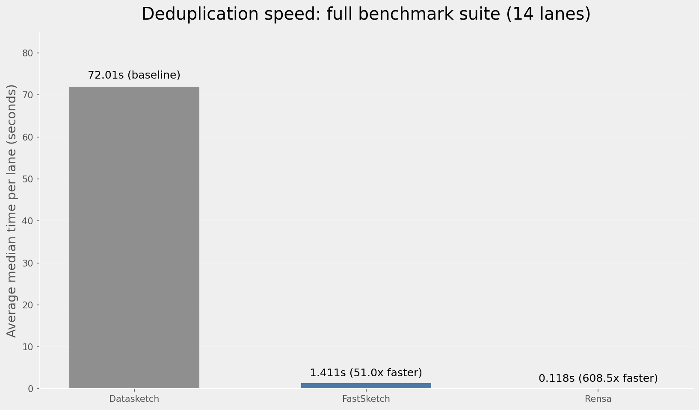

# Rensa

High-performance MinHash in Rust with Python bindings, with SIMD sketching and batch deduplication APIs.

## What is Rensa?

Rensa (Swedish for "clean") computes MinHash signatures for similarity estimation and deduplication, including approximate batch processing for finding near-duplicates in large datasets.

It ships two MinHash variants:

- **R-MinHash**: Full-set similarity sketching with seeded bucket rounds, a SIMD fallback, and 32-bit signature slots.
- **C-MinHash**: A practical approximation of [circulant MinHash](https://proceedings.mlr.press/v162/li22m.html), with 64-bit signature slots and nonlinear permutations.

The separate **rho batch path** samples token positions to accelerate duplicate detection. Its recall depends on document length and token order, so its speed should be evaluated together with retrieval accuracy. Use the classic full-set APIs when you need order-invariant Jaccard estimates.

[](https://colab.research.google.com/drive/1o1nzwXWAa8kdkEJljbJFW1VuI-3VZLUn?usp=sharing) &nbsp; Thanks [mlabonne](https://github.com/mlabonne) for the Colab notebook!

## Performance

The historical reference run below used `benchmarks/full_benchmark.py` over 7 datasets and 2 thread lanes (`threads=1,8`), 128 permutations, threshold 0.8, and 8 bands. Its raw results, hardware details, and dependency versions are not checked in, so these figures should not be treated as a verified comparison of current releases.



| Comparison | Average speedup |
| ---------- | --------------- |
| **Rensa vs Datasketch** | **608.52x faster** |
| **Rensa vs FastSketch** | **11.92x faster** |

| Agreement vs Datasketch | Value |
| ---------------------- | ----- |
| Mean Jaccard of kept sets | 0.987219 |
| Mean duplicate-flag mismatch rate | 0.010717 |

These agreement metrics are from the same full benchmark run as the speed numbers above. They compare duplicate decisions with Datasketch, not with exact Jaccard ground truth. The benchmark uses Rensa’s approximate rho matrix and one-shot duplicate flags. Current FastSketchLSH also uses its fused duplicate-flag API; older versions fall back to candidate lists, as does Datasketch. The speedups describe these deduplication pipelines, not every MinHash API or workload.

## How R-MinHash works

MinHash estimates Jaccard similarity from the fraction of matching signature slots. R-MinHash version 2 uses every input token and a fixed family of hash functions for each `(num_perm, seed)`. Reordering tokens, repeating tokens, or dividing them across incremental updates produces the same signature.

The sketch uses three seeded bucket rounds. In each round, a token's hash chooses one of the `num_perm` slots and a rank within that round. Each slot keeps its smallest rank, with earlier rounds taking priority. For a nonempty set, any slot left empty after these rounds receives the actual minimum of its own separately seeded fallback hash over all tokens in the set. Fallback values are computed from tokens, not copied from another bucket. Taking the minimum across updates preserves the same result as processing their union at once.

This is a practical variant of [Fast Similarity Sketching](https://arxiv.org/abs/1704.04370), truncated to a fixed number of bucket rounds before fallback. It uses SplitMix64 mixing for bucket selection and nonlinear mixing followed by seeded affine multiply-shift hashes for fallback. These are approximations to fully random hash functions; the published algorithm's concentration and expected-time guarantees are not established for this variant. Rensa checks its bias, estimation error, and retrieval accuracy against exact Jaccard in `benchmarks/accuracy_benchmark.py`.

Each `u32` slot stores a 2-bit round tag and a 30-bit rank. At 128 slots, the signature values occupy 512 bytes, excluding object and allocation overhead.

`RMinHash.ALGORITHM_VERSION` is **2**. **Rebuild existing R-MinHash signatures and LSH indexes from their original tokens:** legacy serialized sketches and indexes are rejected, and raw digest arrays from different algorithm versions must not be mixed. The separate rho representation is not interchangeable with an R-MinHash signature.

### Performance engineering

On top of the algorithm, Rensa applies several low-level optimizations.

Input elements are hashed with a fast non-cryptographic hash that mirrors `rustc_hash::FxHasher` semantics while avoiding trait dispatch in the hot path. The sketch then applies its seeded mixing stages to these token hashes.

Dense inputs often fill every slot during the bucket rounds, allowing the kernel to skip fallback work. When many slots need fallback, a SIMD kernel evaluates the same fallback hashes together; when few remain, only those slots are evaluated. These paths change how the fixed hash family is evaluated, so short and long documents remain comparable and incremental updates preserve their meaning.

Fallback coefficients are deterministic, derived from a seed via Xoshiro256++, and reused across updates. Their tables and SIMD layouts are shared process-wide per `(num_perm, seed)` to avoid repeated parameter setup. Constructing or cloning a sketch still requires O(`num_perm`) work to allocate or copy its signature values.

Token extraction reads compact ASCII `str` data inline (the common case for tokenized text) instead of round-tripping through `PyUnicode_AsUTF8AndSize`.

The separate rho batch path can parallelize extraction for lists of ASCII/bytes tokens: worker threads read list items and string payloads directly from CPython object memory while the calling thread holds the GIL and runs no Python callbacks. Rows containing other token types fall back to the GIL thread. Rho's one-shot LSH deduplication groups rows by raw band hashes with intrusive chains, refines fold windows by exact hash-pair equality, and reuses collision counts for its recall-rescue pass. Band scans run in parallel when a Rayon pool is available.

The global allocator is MiMalloc, which handles the batch-allocate-then-free pattern better than the system default. Rensa disables MiMalloc's eager arena commit at module load (unless overridden via `MIMALLOC_ARENA_EAGER_COMMIT`), which keeps peak RSS flat when many threads allocate short-lived sketch buffers.

### C-MinHash

Rensa follows the input rotation in Algorithm 3 of Xiaoyun Li and Ping Li's [C-MinHash paper](https://proceedings.mlr.press/v162/li22m/li22m.pdf): `h[k] = min(pi(sigma(x) - (k + 1)))`, with subtraction modulo 2^64. Two separately seeded [SplitMix64 finalizers](https://prng.di.unimi.it/splitmix64.c) provide nonlinear bijections over token hashes. These are compact pseudorandom approximations; the paper's unbiasedness and lower-variance proofs assume uniformly random permutation vectors and do not establish those guarantees for this implementation. Accuracy is checked empirically against exact Jaccard.

`CMinHash.ALGORITHM_VERSION` is **2**. Version 1 used affine maps that produced biased estimates on structured hashes and highly correlated signature slots. Its sorted-successor optimization depended on that faulty construction and has been removed. Version 2 performs O(nk) work, with bounded token batches. **Rebuild existing C-MinHash signatures and indexes from their original tokens:** legacy serialized C-MinHash states are rejected, and old digest arrays must not be mixed with version 2 arrays.

Streaming duplicate checks stop comparing a pair once its remaining signature slots cannot meet the threshold.

`CMinHashDeduplicator` builds an exact candidate index after 128 stored entries. If the threshold permits `d` mismatching signature slots, it partitions the signature into `d + 1` disjoint bands: every accepted duplicate must match at least one complete band. Candidates still pass the same signature comparison, so hash collisions only cause extra checks. This accelerates insertion and boolean duplicate checks at the cost of additional memory proportional to stored entries times band count. Singleton buckets stay inline. Collections initially use a scan, and thresholds requiring at most one matching slot always use a scan. `get_duplicates()` retains its full scan.

## Installation

```bash
uv add rensa
```

Works on Linux, macOS, and Windows. Python >= 3.8.

## Usage

### Computing similarity

```python
from rensa import RMinHash

m1 = RMinHash(num_perm=128, seed=42)
m1.update("the quick brown fox jumps over the lazy dog".split())

m2 = RMinHash(num_perm=128, seed=42)
m2.update("the quick brown fox jumps over the lazy cat".split())

print(m1.jaccard(m2))  # ~0.78
```

`CMinHash` has the same interface. Just swap the class name.

### Deduplicating a dataset

```python
from datasets import load_dataset
from rensa import RMinHash, RMinHashLSH

dataset = load_dataset("gretelai/synthetic_text_to_sql")["train"]

# Build MinHash signatures
minhashes = {}
for idx, row in enumerate(dataset):
    m = RMinHash(num_perm=128, seed=42)
    m.update(row["sql"].split())
    minhashes[idx] = m

# Index into LSH
lsh = RMinHashLSH(threshold=0.8, num_perm=128, num_bands=16)
for doc_id, mh in minhashes.items():
    lsh.insert(doc_id, mh)

# Find and remove duplicates
to_remove = set()
for doc_id, mh in minhashes.items():
    if doc_id in to_remove:
        continue
    for candidate in lsh.query(mh):
        if candidate != doc_id and candidate not in to_remove:
            if mh.jaccard(minhashes[candidate]) >= 0.85:
                to_remove.add(max(doc_id, candidate))

print(f"Removed {len(to_remove)} duplicates from {len(dataset)} rows")
```

### Batch APIs

For large batches, build and query in bulk to reduce Python call overhead:

```python
from rensa import RMinHash, RMinHashLSH, RMinHashDeduplicator

token_sets = [
    "select id from users".split(),
    "select name from users".split(),
    "select id from users".split(),
]
keys = [f"doc-{idx}" for idx in range(len(token_sets))]

minhashes = RMinHash.from_token_sets(token_sets, num_perm=128, seed=42)
digests = RMinHash.digests_from_token_sets(token_sets, num_perm=128, seed=42)

lsh = RMinHashLSH(threshold=0.8, num_perm=128, num_bands=8)
lsh.insert_pairs(enumerate(minhashes))
candidates_per_doc = lsh.query_all(minhashes)

dedup = RMinHashDeduplicator(threshold=0.8, num_perm=128, use_lsh=True, num_bands=8)
added_flags = dedup.add_pairs(zip(keys, minhashes))
is_dup_flags = dedup.is_duplicate_pairs(zip(keys, minhashes))
duplicate_sets = dedup.get_duplicate_sets(minhashes)
```

`CMinHash` supports the same batch constructors, plus `digests64_from_token_sets(...)`.

For expert throughput paths (when you already have hashed tokens or byte tokens):

```python
from rensa import CMinHash, RMinHash

token_sets = [
    "select id from users".split(),
    "select name from users".split(),
]
token_hash_sets = RMinHash.hash_token_sets(token_sets)

r_matrix = RMinHash.digest_matrix_from_token_hash_sets(
    token_hash_sets, num_perm=128, seed=42
)
byte_matrix = RMinHash.digest_matrix_from_token_byte_sets(
    [[b"alpha", b"beta"], [b"gamma", b"delta"]],
    num_perm=128,
    seed=42,
)
c_digests64 = CMinHash.digests64_from_token_hash_sets(
    token_hash_sets, num_perm=128, seed=42
)
```

`RMinHash.digest_matrix_from_flat_token_hashes(values, offsets, num_perm, seed)` accepts flat token hashes and row boundaries. Typed token buffers must contain contiguous native-endian `uint64` values. Large buffers in single-thread mode are read directly while retaining the GIL; parallel processing uses an owned copy. Row offsets are read before acquiring the token buffer.

### Streaming deduplication

For continuous data streams, use the built-in deduplicator:

```python
from rensa import RMinHash, RMinHashDeduplicator

dedup = RMinHashDeduplicator(threshold=0.8, num_perm=128, use_lsh=True, num_bands=16)

for doc in document_stream:
    mh = RMinHash(num_perm=128, seed=42)
    mh.update(doc["text"].split())

    if not dedup.is_duplicate(doc["id"], mh):
        dedup.add(doc["id"], mh)
        # process unique document
```

## API

### RMinHash / CMinHash

| Method                           | Description                                                |
| -------------------------------- | ---------------------------------------------------------- |
| `__init__(num_perm, seed)`       | Create a MinHash with `num_perm` permutations              |
| `update(items)`                  | Add items (list of strings, bytes, or iterables)           |
| `jaccard(other)`                 | Estimate Jaccard similarity (requires matching `num_perm` and `seed`) |
| `digest()`                       | Return the signature as a list of integers                 |
| `from_token_sets(...)`           | Build many MinHash objects from token iterables            |
| `digests_from_token_sets(...)`   | Compute many digests in one call                           |
| `hash_token_sets(...)`           | Hash token sets to reusable `u64` token hashes             |
| `digest_matrix_from_token_sets(...)` | Build compact row-major digest matrix                  |
| `digest_matrix_from_token_hash_sets(...)` | Build compact digest matrix from pre-hashed `u64` tokens |
| `digest_matrix_from_token_byte_sets(...)` | Build compact digest matrix from bytes-like tokens |
| `digests64_from_token_sets(...)` | `CMinHash` only, returns `u64`-precision digests           |
| `digests64_from_token_hash_sets(...)` | `CMinHash` only, uses pre-hashed `u64` tokens         |

### RMinHashLSH

| Method                                     | Description                                                    |
| ------------------------------------------ | -------------------------------------------------------------- |
| `__init__(threshold, num_perm, num_bands)` | Create an LSH index. `num_bands` must divide `num_perm` evenly |
| `insert(key, minhash)`                     | Add a document to the index                                    |
| `query(minhash)`                           | Return candidate similar document keys                         |
| `remove(key)`                              | Remove a document from the index                               |
| `insert_pairs(entries)`                    | Insert many `(key, minhash)` pairs                             |
| `insert_many(minhashes, start_key=0)`      | Insert many `minhashes` with sequential keys                   |
| `query_all(minhashes)`                     | Query many minhashes in one call                               |
| `query_duplicate_flags(minhashes)`         | Return `len(query(minhash)) > 1` flags for many minhashes      |

### RMinHashDeduplicator / CMinHashDeduplicator

| Method                                                               | Description                                 |
| -------------------------------------------------------------------- | ------------------------------------------- |
| `RMinHashDeduplicator(threshold, num_perm, use_lsh, num_bands=None, seed=42)` | R-MinHash streaming deduplicator            |
| `CMinHashDeduplicator(threshold, num_perm=None, seed=42)`           | C-MinHash streaming deduplicator            |
| `add(key, minhash) -> bool`                                          | Add if unique, returns whether it was added |
| `is_duplicate(key, minhash) -> bool`                                 | Check without adding                        |
| `get_duplicates(minhash) -> list[str]`                               | Find keys of similar stored items           |
| `remove(key)` / `clear()`                                            | Manage stored items                         |
| `add_pairs(entries) -> list[bool]`                                   | Batch add `(key, minhash)` or `(key, token_set)` pairs |
| `is_duplicate_pairs(entries) -> list[bool]`                          | Batch duplicate checks for minhash or token-set pairs  |
| `get_duplicate_sets(minhashes) -> list[list[str]]`                   | Batch duplicate candidate lookup (minhash or token-set inputs) |

## Running Benchmarks

```bash
git clone https://github.com/beowolx/rensa.git && cd rensa
uv venv && uv sync --group bench --no-install-project
uv run maturin develop --release
uv run python benchmarks/simple_benchmark.py
```

Run the full cross-library benchmark (single-thread + multi-thread lanes):

```bash
uv run python benchmarks/full_benchmark.py
```

`benchmarks/` contains these scripts:

- `benchmarks/simple_benchmark.py`: single-thread quick comparison across Datasketch, FastSketch, R-MinHash, and C-MinHash.
- `benchmarks/full_benchmark.py`: fair per-run process-isolated benchmark (all engines per subprocess, randomized order) across Datasketch, FastSketch, and Rensa on the full dataset preset suite.
- `benchmarks/kernel_benchmark.py`: deterministic Rensa-only timings for token hashing, classic and rho sketching, streaming C-MinHash insertion, and duplicate queries, with exact output hashes for comparing builds. For example: `RAYON_NUM_THREADS=1 uv run python benchmarks/kernel_benchmark.py --output-json .bench/kernels.json`.
- `benchmarks/sketch_benchmark.py`: batch sketch construction on identical byte tokens across classic R-MinHash, C-MinHash, rho, Datasketch and FastSketch. Input preparation and digest normalization are outside timing. Use `--prehashed --sizes 0 1 8 128 4096 65536 1048576 --num-perm 128 512` to compare the R-MinHash and FastSketch flat-buffer APIs through million-token rows; input size is capped by reducing the row count. Add `--repeat-cardinality 4` to measure repeated inputs.
- `benchmarks/accuracy_benchmark.py`: bias, RMSE and threshold classification against exact Jaccard, plus separate query-all retrieval precision/recall on aligned and reordered pairs. For example: `uv run python benchmarks/accuracy_benchmark.py --output-json .bench/accuracy.json`.

Kernel measurements run each case, input size, and permutation count in a fresh subprocess by default, with 200 ms of untimed warmup and at least 100 ms per sample. Use `--in-process` only for diagnosis. For noisy multi-thread measurements, increase `--min-sample-seconds` and alternate the order of the builds. Keep all samples; large timing dispersion makes a comparison inconclusive.

`simple_benchmark.py` times `rensa_c`, but excludes it from accuracy comparisons because `CMinHashDeduplicator.add_pairs` uses streaming add-if-unique semantics rather than batch query-all semantics.

## Contributing

Contributions welcome, just open a PR or issue.

## License

MIT
